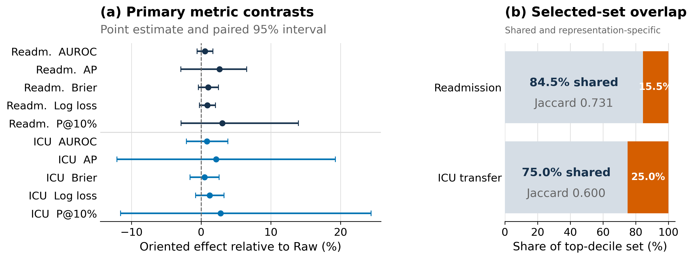

# Similar Scores, Different High-Risk Episodes: Auditing Model Selection in Longitudinal EHRs

**Polina Korobeinikova, Dmitry Lvov, Ilya Pershin**

Poster at TAE (Trust-AI-Eval), NeurIPS 2026

[Paper on OpenReview](https://openreview.net/forum?id=RffArnWpec)

## Overview

Do similar prediction scores lead to the same high-risk selections? We compare
raw EHR histories with persistence-aware **Era+backfill** sequences on EHRSHOT
30-day readmission and ICU transfer, across 14 task-representation pairs and
five training seeds. The evaluation connects predictive performance with
calibration, retraining stability, fixed-capacity selection, and controlled
diagnosis repetition.

Era+backfill has better point estimates in all ten primary task-metric
comparisons, but every paired patient-cluster 95% interval includes zero.
Meanwhile, **34 of 219 readmission episodes (15.5%)** and **51 of 204 ICU
episodes (25.0%)** in each primary top-decile set are representation-specific.
Controlled repetition reveals task-specific sensitivity, complementing the
performance, calibration, and selection-agreement results described in the paper.

<p align="center">
  
</p>

*Similar aggregate scores can coexist with different prioritized episodes.*

## Quick Start: Public Aggregates

Use Python 3.13 and run from the repository root. No EHR records, GPU,
credentials, or external services are needed.

```bash
python -m venv .venv
source .venv/bin/activate
python -m pip install -r requirements-public.txt
python paper/reproduce_public.py
```

On Windows PowerShell, use `.venv\Scripts\Activate.ps1` for activation.
This regenerates three figures and the tables from [public aggregates](paper/aggregate_outputs/),
not models or patient-level bootstrap intervals. The CSV field `auprc` denotes
**average precision (AP)**.

## Full Experiments

Use a separate Python 3.12 environment with `requirements.txt`.
The [experiment guide](docs/EXPERIMENTS.md) covers train-only whitelist
construction, sequence building, multiseed training, and repetition experiments.
Configure private data and output paths, use fresh caches for changed inputs,
and keep restricted inputs and outputs outside version control.

**EHRSHOT requires separate authorized access** under its Credentialed Health
Data License. Do not redistribute medical-data rows, patient identifiers,
row-level predictions, or checkpoints; keep restricted inputs and outputs
outside the public repository.

## Paper Analyses

With the authorized private reproducibility package, follow the
[analysis commands](docs/EXPERIMENTS.md) to recompute aggregate metrics,
calibration, selected-set comparisons, and strictly pre-prediction repetition
summaries. These analyses require restricted inputs; the public quick start
only redraws the published aggregate evidence.

## Citation

Please cite the paper linked on [OpenReview](https://openreview.net/forum?id=RffArnWpec)
and use [CITATION.cff](CITATION.cff) for author and repository metadata.
See [LICENSING.md](LICENSING.md) for code reuse and third-party terms; no blanket
software license is currently assigned.

## Acknowledgments

All authors are affiliated with Innopolis University; Dmitry Lvov is also
affiliated with ITMO University and Ilya Pershin with Kazan Federal University.
This study was supported by the Ministry of Economic Development of the Russian
Federation (agreement No. 139-10-2025-034 dated 19.06.2025,
IGK 000000C313925P4D0002).
